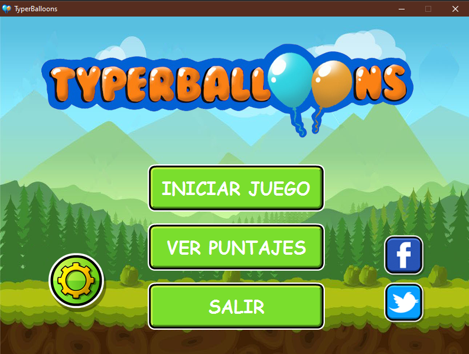
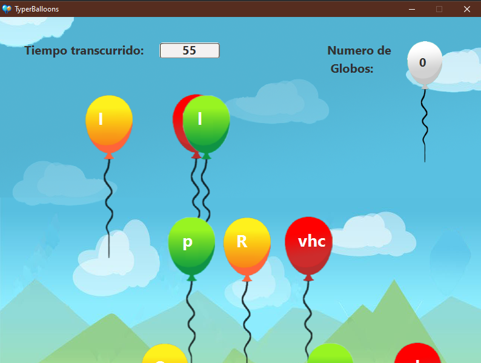
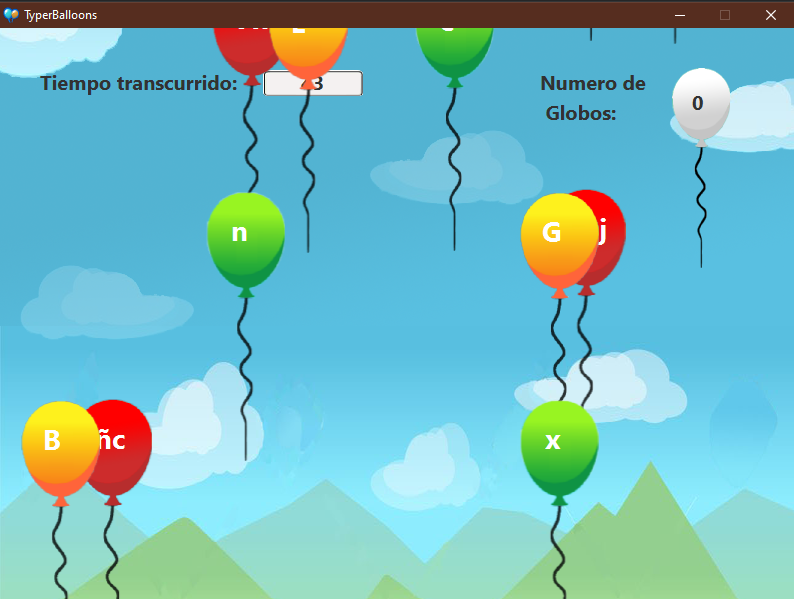
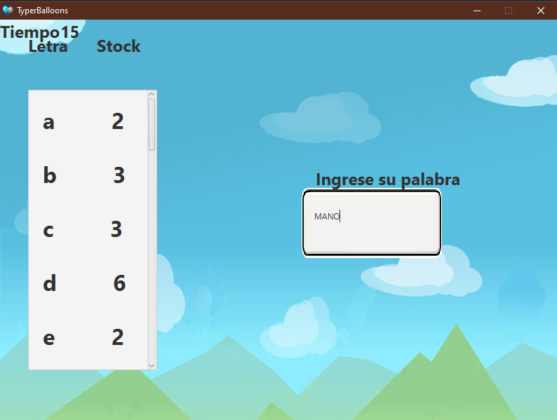
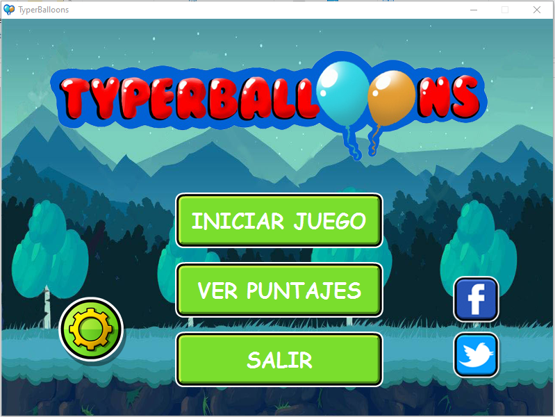
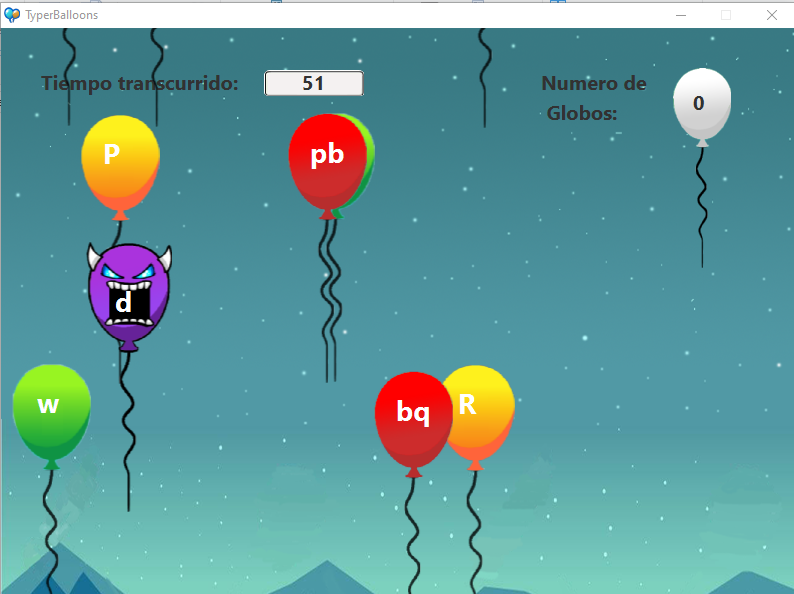

[![language][language-shield]][language-url]
[![Codacy Badge][codacybadge-shield]][codacybadge-url]
[![repoSize][repoSize-shield]][repo]
[![Contributors][contributors-shield]][contributors-url]
[![forks][forks-shield]][forks-url]
[![Stargazers][stars-shield]][stars-url]
[![Issues][issues-shield]][issues-url]
[![lastCommit][lastCommit-shield]][lastCommit-url]
[![LinkedIn][linkedin-shield]][linkedin-url]
[![Twitter][twitter-shield]][twitter-url]


# TyperBalloons
**TyperBalloons** is a game that gives the players the oportunity of improve their speed on the keyboard in a very entreteining way, and also it helps them to train their spanish vocabulary, through all the levels that this game offers to them.

## The game
<div align='center'></div>

The game consists in two parts:
* In the first part the player has 60 seconds to collect as many letters as possible.

<div align='center'>
  
  
</div>

* In the second part the player has 30 seconds to build as many valid spanish words as possible, usign the collected letters in part1.

<div align='center'></div>

### Dark Theme
**TyperBalloons** also has a dark theme mode for those users who love dark theme
<div align='center'></div>

### Balloons Types
In **TyperBalloons** There are 3 types of baloons:
* Green Balloons: The green balloons contain inside an unique lower-case letter which you have to press to explode the balloon and collect that letter.
* Yellow Balloons: The yellow balloons contain inside an unique upper-case letter which you have to press to explode the balloon and collect that letter, we shall need to switch the caps lock to lead the game successfully.
* Red Balloons: The red balloons contain inside either two or three letters inside, which you need to press all the letters inside to explode the balloon and collect those letters.

#### Take care
There are a few demon balloons 😈 which you need to avoid or you will lose all your collected letters.

<div align='center'></div>

### Considerations
Since the vocabulary in the game is Spanish, you would need to change your keyboard language because it can appear letters like "ñ" in the balloons to form words with that letter, and if you do not have that letter on your keyboard, you won't be able to press that letter and therefore, explode the balloon.

In spanish there are few words with "tilde" like "estás", but in **TyperBalloons** the tildes are not considered, so you can feel free of that.


## Prerequisites 📋

You should have the java virtual machine installed(JVM) on your computer to run the game, if you do not have the java virtual machine you could install it from [here](https://www.java.com/es/download/).

### Installation 🔧

You only need to download this project.

To run the game you need to get into the folder "dist", which is in the root directory, and then execute the "TyperBallons.jar" file.

Or you can also run this from the shell, you need to cd to the project folder, and then execute:
```
java -jar dist/TyperBalloons.jar
```

## Built with 🛠️
* Java8
* JavaFx
* Photoshop

## Autors ✒️
This project would not have been possible without the collaboration of:
* **👩‍💻 Valeria Barzola -** Developer
* **👩‍💻 Joangie Marquez -** Developer [joangiemarquez](https://github.com/joangiemarquez)
* **👨‍💻 Alex Velez -** Developer [AlexVelezLl](https://github.com/AlexVelezLl)

[language-shield]: https://img.shields.io/badge/Java-v1.8.0-blue?style=plastic
[language-url]: https://www.java.com/es/download/
[codacybadge-shield]: https://img.shields.io/codacy/grade/d44d64306d954ec0884cdb50681a4169?style=plastic
[codacybadge-url]: https://www.codacy.com/manual/AlexVelezLl/TyperBalloons?utm_source=github.com&amp;utm_medium=referral&amp;utm_content=AlexVelezLl/TyperBalloons&amp;utm_campaign=Badge_Grade
[repoSize-shield]: https://img.shields.io/github/repo-size/AlexVelezLl/TyperBalloons?style=plastic
[repo]: github.com/AlexVelezLl/TyperBalloons
[contributors-shield]: https://img.shields.io/badge/contributors-3-success?style=plastic
[contributors-url]: https://github.com/AlexVelezLl/TyperBalloons/graphs/contributors
[forks-shield]: https://img.shields.io/github/forks/AlexVelezLl/TyperBalloons?style=plastic
[forks-url]: https://github.com/AlexVelezLl/TyperBalloons/network/members
[stars-shield]: https://img.shields.io/github/stars/AlexVelezLl/TyperBalloons?style=plastic
[stars-url]: https://github.com/AlexVelezLl/TyperBalloons/stargazers
[issues-shield]: https://img.shields.io/github/issues/AlexVelezLl/TyperBalloons?style=plastic
[issues-url]: https://github.com/AlexVelezLl/TyperBalloons/issues
[lastCommit-shield]: https://img.shields.io/github/last-commit/AlexVelezLl/TyperBalloons?style=plastic
[lastCommit-url]: https://github.com/AlexVelezLl/TyperBalloons/commits
[linkedin-shield]: https://img.shields.io/badge/-LinkedIn-black.svg?style=plastic&logo=linkedin&colorB=555
[linkedin-url]:https://www.linkedin.com/in/alex-velez-llaque-4b3327191/
[twitter-shield]:https://img.shields.io/twitter/follow/AlexVelezLl?label=Follow&style=social
[twitter-url]:https://twitter.com/AlexVelezLl
